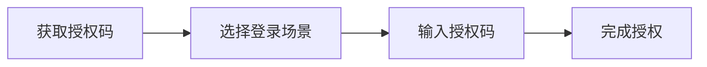

# TuneFree 授权指南 🔐

> 本文档将帮助你了解 TuneFree 的授权机制，包括如何获取和使用授权码。

## 一、重要须知 ❗

::: danger 授权码规则
1️⃣ 一码一用：每个授权码仅能使用一次  
2️⃣ 即时失效：使用后立即失效  
3️⃣ 顺序获取：必须等待当前授权码使用后才能获取新的
:::

## 二、获取授权码 📱

### 第 1 步：下载用户中心
```bash
下载地址：https://pan.sayqz.com/d/公共资源/TuneFree/TF用户中心.apk
或使用网页版：https://auth.sayqz.com/
系统要求：Android 7.0+
安装条件：无需 root
```

### 第 2 步：注册账号
```bash
1. 准备 QQ 邮箱
2. 绑定网易云账号
3. 完成白名单验证
```

### 第 3 步：获取授权码
```bash
1. 打开用户中心
2. 登录你的账号
3. 进入个人中心页面
4. 点击"获取授权码"按钮
```

## 视频教程 📺

::: center
<video controls width="100%" height="400">
  <source src="https://pan.sayqz.com/d/%E5%85%AC%E5%85%B1%E8%B5%84%E6%BA%90/TuneFree/%E6%95%99%E7%A8%8B/%E6%8E%88%E6%9D%83%E7%A0%81%E4%BD%BF%E7%94%A8%E6%95%99%E7%A8%8B.mp4" type="video/mp4">
  你的浏览器不支持 video 标签。
</video>
:::

## 三、使用说明 📖

### 1. 适用场景
| 客户端类型 | 说明 |
|-----------|------|
| Windows 端 | 电脑客户端登录 |
| Android 端 | 手机客户端登录 |
| 下载器 | 音乐下载器登录 |
| Web 端 | 网页版在线使用 |

### 2. 使用流程


## 四、常见问题 💭

### 问题 1：无法获取新授权码
::: warning 解决方案
✅ 检查当前授权码是否已使用  
✅ 确认账号状态正常  
✅ 检查网络连接
:::

### 问题 2：授权码无法使用
::: warning 解决方案
✅ 确认是否为未使用的授权码  
✅ 仔细核对输入内容  
✅ 检查网络状态
:::

## 五、安全建议 🛡️

::: tip 安全提醒
1. 授权码私密性
   - 禁止分享给他人
   - 不使用他人授权码
   
2. 使用建议
   - 及时使用新获取的授权码
   - 保持网络环境稳定
   - 遇问题及时反馈
:::

## 六、获取帮助 🆘

如果遇到问题，可以通过以下方式获取帮助：

1. 📚 查看本文档
2. 💬 在频道内反馈
3. 📧 联系技术支持

::: note 温馨提示
建议收藏本文档，遇到问题时可以随时查阅！ 